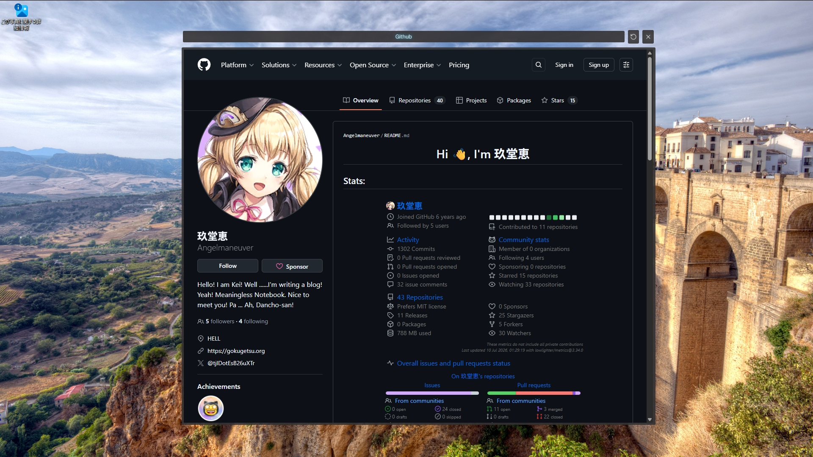

# Web Page Monitor



This Tauri app like a widget allows you to display the web page on your desktop.

```
NAME
    Web Page Monitor

SYNOPSIS
    web-page-monitor --label <Uniqe name> --url <Web Page Url>

ARGUMENTS
    Uniqe name
        Used to manage the text displayed in the title bar and the window state
    Web Page Url
        The url of the web page you want to display

NOTES
    Error handling is incomplete
```
